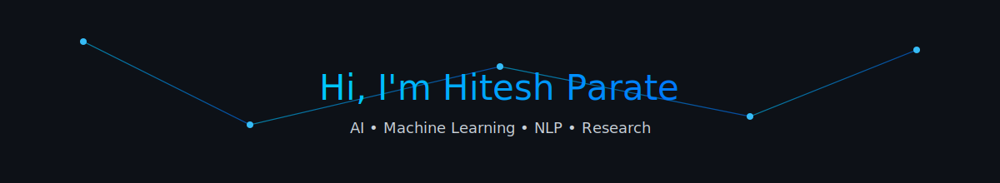

<!-- HEADER GIF -->

# 👋 Hi, I'm **Hitesh Parate**
### B.Tech in Artificial Intelligence & Machine Learning  
### **AI & ML Engineer | GenAI | LLMs | Backend Systems**  
📍 *Nagpur, India*

---

## 🚀 About Me
I am a driven **AIML Engineer** passionate about building intelligent systems that bridge complex data with real-world impact.  
My focus lies in **Generative AI**, **LLM systems**, **backend engineering**, and **scalable automation pipelines**.

I aim to craft solutions that blend sound engineering with modern AI capabilities.

---

## 🎯 Technical Focus Areas
- **Structured Data Analysis**
- **Intelligent Decision Systems**
- **Generative AI Pipelines**
- **Scalable Backend Engineering**
- **LLM Integrations & RAG Systems**

---

# 🛠️ Tech Stack & Expertise

| | |
|---|---|
| 🧑‍💻 Languages |    |
| 🤖 GenAI & ML |      |
| 🧩 Frameworks |      |
| 🗄️ Databases |     |
| 🧰 Tools |     |

# 📊 GitHub Stats:
 
 

---

# 🌱 Let’s Connect
💡 Open to learning, collaboration, and meaningful discussions.  

  

